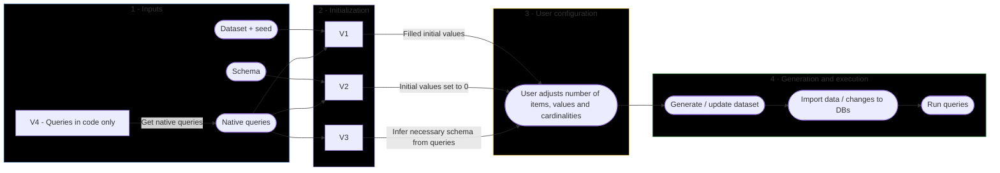

```mermaid

flowchart LR
    subgraph INPUTS["1 - Inputs"]
        direction TD
        DATASET(["Dataset + seed"])
        QUERIES(["Native queries"])
        SCHEMA(["Schema"])
        CODE_QUERIES["V4 - Queries in code only"]
        CODE_QUERIES -->|" Get native queries "| QUERIES
    end

    subgraph INIT["2 - Initialization"]
        direction TD
        V1["V1"]
        V2["V2"]
        V3["V3"]
    end

    DATASET --> V1
    QUERIES --> V1
    SCHEMA --> V2
    QUERIES --> V2
    QUERIES --> V3

    subgraph CONFIG["3 · User configuration"]
        ADJUST(["User adjusts number of items, values and cardinalities"])
    end

    V1 -->|" Filled initial values "| ADJUST
    V2 -->|" Initial values set to 0 "| ADJUST
    V3 -->|" Infer necessary schema from queries "| ADJUST

    subgraph EXECUTION["4 · Generation and execution"]
        direction TD
        GENERATE(["Generate / update dataset"])
        IMPORT(["Import data / changes to DBs"])
        RUN(["Run queries"])
        GENERATE --> IMPORT --> RUN
    end

    ADJUST --> GENERATE
    classDef input fill: #DBEAFE, stroke: #2563EB, color: #1E3A8A
    classDef init fill: #EDE9FE, stroke: #7C3AED, color: #4C1D95
    classDef config fill: #222222, stroke: #D97706, color: #78350F
    style INPUTS fill: #000000, stroke: #93C5FD
    style INIT fill: #000000, stroke: #C4B5FD
    style CONFIG fill: #000000, stroke: #FCD34D
    style EXECUTION fill: #000000, stroke: #197629
```
