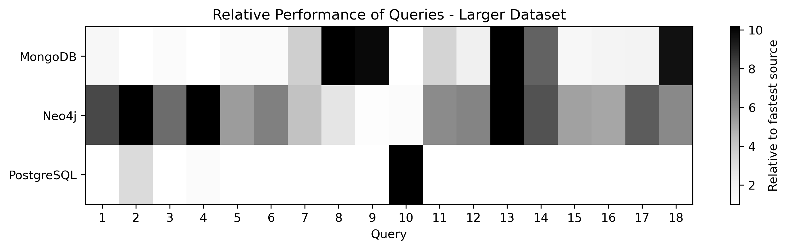
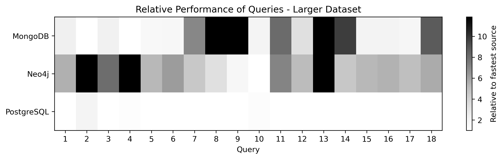

# Vyhodnocování výkonnosti počítačových systémů

Závěrečný performance evaluation experiment, Šimek Jan

## Uvedení projektu

Cílem projektu je připravit framework a hlavně také dobře nadefinované a později realitě se blížící datové sady. Pro tyto sady pak dále připravit výběr ekvivalentních dotazů pokrývajících běžné potřeby softwaru. Projekt je zatím v začátcích, a tedy chybí dodělat některé funkce a řada věcí čeká na přepsání a redesign.

V první fázi projektu jsme nadefinovali sadu dotazů, které pokrývají základní požadavky na OxM frameworky. Tyto sady jsme naimplementovali pro Javovské objektově mapující frameworky. Dále také jsme nadefinovali a přidali i některé komplexní dotazy, které by měli připomínat skutečný provoz aplikace.

Momontálně se projekt nachází ve fázi, kde je možné jej spustit na první čistě generované datové sadě. Na této sadě zatím pouštíme základní kolekci dotazů. To vše umíme spustit pro tři vybrané frameworky pro námi požadované druhy databází a to relační, dokumentovou a grafovou.

## Definice problému

V experimentu bychom rádi porovnali, na které typy dotazů se hodí který framework pro objektové mapování více a na které méňe. Jinak řečeno chceme změřit, které dotazy vykonává který framework + databáze jak rychle.

Tím můžeme například umožnit jednodušší výběr databázového systému a frameworku pro začínající projekty.

Protože nám jde o porovnání skutečných délek vykonávání celého dozatu, tedy to co uživatel pocítí při fungování programu, budeme měřit i čas na vytváření pomocných objektů a volání pomocných funkcí zahrnutých ve workflow daného OxM frameworku. Tato reálnost měření je záměrná, ve výsledném programu nás bude ovlivňovat.

## Design experimentu

Exeperiment cílí na jednoduchost spuštění a replikovatelnost. Ideálně bychom chtěli spuštění jedním příkazem a pro náročnější uživatele připravujeme konfigurační soubor (`./oxm_config.yaml`) s mnoha možnostmi upravení parametrů experimentu. 

Experiment lze rozdělit na následující fáze:

- **Příprava databází**. Databáze se sami nasadí jako konteinery nebo má uživatel možnost připojit vlastní instance v konfiguraci (`importer/${vybraná databáze}`) pomocí specifikování URL, authentikace, atd. V konfiguračním souboru také můžeme definovat množinu databází/frameworků, které nás zajímají (`databaseToUse`) a ostatní nebudou spouštěny.

- **Generování datové sady**. Datovou sadu pro experiment generujeme přímo za běhu. V konfigureci je možné změnit velikost datové sady (`TBD`) a seed pro generování (`generator/dataSeed`). Datovou sadu generujeme jednou (one source of truth) do CSV a JSON souborů. Z těchto souborů jí poté importujeme do databází v dalším kroku. Tímto zajistíme, že data budou úplně shodná ve všech databázích a rozdíly neovlivní měření.

- **Importování datové sady**. Vygenerovanou datovou sadu importujeme do každé databáze. Snažíme se o ekvivalentní reprezentaci dat, ale z principu jsou některé vlastnosti a možnosti databází a frameworků různé.

- **Běh experimentu a měření**. Postupně vykonáváme připravené query na jednotlivých objektově mapovacích frameworcích a měříme délky vykonávání. Do měření také nezahrnujeme zahřívání a každou query opakujeme vícekrát pro přesnější výsledky.

V projektu je nyní velmi důležité nadesignovat běh měření pro snadné budoucí rozšíření, čehož se snažíme dosáhnout několika stupněmi abstrakce. Jednotlivé `Query` jdou řadit do `Runů` a tyto běhy pak vykonávat daný počet opakování nadefinovaný v konfiguraci (`TBD`).

## Technické provedení experimentu

Díky potřebě všech tří databázových systémů a přítomnosti více částí Javovského kódu jsme se rozhodli pro celkovou orchestraci pomocí Docker Compose. Při spuštění celého experimentu se nejprve spustí konteinery s těmito databázemi. V konfiguračním souboru může také uživatel nastavit místo toho vlastní instanci přímo na jeho stroji.

Mezi každými dvěma běhy dotazů je vyčištěna `Session`, abychom předešli cachování výsledků. Pro Hibernate jsme také vypli `second_lazer_cache` a `query_cache`.

Pro samotné měření používáme Javovskou metodu `System.nanoTime()`, který má obecně nízký overhead a velkou přesnost. Jak později uvidíme ve výsledcích měření, tak se v nejnižších naměřených hodnotách pohybujeme v řádech milisekund (a jinde i o dost více). To nám dává celkem rozumnou jistotu, že neměříme šum, ale skutečnou dobu vykonávání kódu.

## Analýza výsledků

Pro potřeby experimentu jsem nechal běžet benchmark dvakrát. Kvůli limitaci v hardwaru a času jsem volil poměrně nízké množství dat, ale už na tomto rozmezí vidíme zajímavé rozdíly. Každá query byla zopakována dvacetkrát s prvotním warm-upem.

Výsledky měření je možné vidět v tomto repozitáři v souborech `results.json` a `results_larger.json`. Do budoucna předpokládáme rozšíření, zpřehlednění a změnu formátu výsledků, a také například zahrnutí dalších metrik jako běh OxM bez čekání na samotnou databázi, díky kterému by bylo možné porovnávat lépe dva frameworky nad stejnou databází.

Výsledky jsem pro lepší vizualizaci zanesl do heatmapy, která porovnává délky jednotlivých query napříč frameworky/databázemi. Kód vytváření této heatmapy je k dispozici v tomto repozitáři v `perf-eval-final.ipynb`. 

Neporovnáváme běhy všech query proti sobě, kvůli jejich velkým časovým rozdílům a ani by to nedávalo smysl. Není třeba porovnávat komplexní join s jednoduchým indexovaným selektem. Z tohoto důvodu je tmavost naškálovaná na nejnižší hodnotu ze tří testovaných databází/frameworků.

Dále je třeba zmínit, že horní hodoty jsou useknuté na 90tém percentilu, kvůli hodnotám ležícím velmi daleko zkreslujícím porovnání mezi dalšími dvěmi (v takovám případě by jinak byly druhé dvě pole obě prakticky bílé). 

### První běh

První běh byl proveden na řádově jednom tisíci entit.

Z výskedů měření můžeme vidět, že ve většině query je nejpomalejší Neo4j zatímco PostgreSQL s Hibernate se u takto malých dat zdá být velmi silnou možností.



Ze zajímavých výsledků bych upozornil na:

- Zdá se, že Neo4j má poměrově ještě horší neindexované selekty (`Query 2` a `Query 4`). 

- Naopak MongoDB na neindexovaném vyhledávání naměřilo nejlepší časy z těchto tří.

- Neo4j si vedlo silně na `Query 9` a `Query 10`, které se zaměřují na procházení vztahů grafovým způsobem. Navíc je třeba podotknout, že zbylé dvě databáze takovéto procházení přímo nepodporují, a proto jej nahrazujeme (obcházíme) výrazně složitěji definovanými query.

### Druhý běh

Druhý běh byl proveden na asi 25 tisících entitách.

Nejedná se o velký rozdíl oproti prvnímu běhu, ale šlo mi o otestování posunu výsledných časů.



Změny, na které bych upozornil:

- Na první pohled vyčnívá změna v `Query 10` u PostgreSQL. Z konkrétních hodnot vidíme, že pro menší datovou sadu byl výslede řádově lepší než pro datovou sadu větší.
    - Toto může být způsobeno například nevhoností vygenerovaných dat. `Query 10` je hledání nejkratší cesty v grafu. Je možné, že pro konkrétní data je v menší datové sadě tato délka větší. Toto je pouze jedno z možných vysvětlení a poukazuje na nutnost lépe prozkoumat jednotlivé dotazy a výběr parametrů pro query, který je nyní pevně daný.
```
Q10	 PostgreSQL	 2.814506e+07	Larger
Q10	 PostgreSQL	 2.564468e+08	Smaller
```

- Z dat se také zdá, že pro řadu query se na větších datech srovnává pomalejší běh Neo4j.

- Jinak se výsledky zdají poměrně konzistentní s prvním měřením.

## Závěr 

Experiment byl proveden na plně nových datech v nově připraveném frameworku, který se bude dále rozvíjet a upravovat. I přes tuto výzvu jsme došli k rozumně vypadajícím datům, které vesměs odpovídají očekávání. 

- Relační databáze si vede na jednoduchých dotazech s menším počtem dat velmi dobře.

- Grafová databáze má naopak problémy držet tempo, ale nabízí unikátní možnost správy a procházení sítě, ve které se jí nikdo nevyrovná. 

- U dokumentové databáze jsme našli zajímavou přednost v prohledávání neindexovaných sloupců, ale zároveň dokumentová databáze neměla šanci ukázat své hlavní přednosti, kterými jsou absence pevného schématu, oběm dat, který dokáže spravovat, a zanořování (embedding) objektů do sebe.

### Co by šlo zlepšit:

- V projektu jsou připravené také komplexní query, které chybí jen přepsat do nové workflow a zařadit do běhu.

- Parametry dotazů jsou nyní pevně definované v kódu. V budoucnu je nutná změna, kde parametry budeme získávat při generování dat a případně budeme vynucovat existenci některých hodnot/vztahů, aby nedocházelo k problémům při měření.

- V plánu je také zreálnění generovaných dat. Hlavním problémem jsou nyní vztahy, konkrétně jejich kardinality. V reálných datech budeme očekávat jiné než lineární rozdělení počtu vztahů mezi entitami. Dále je třeba zlepšit datové pooly a využít je správným způsobem pro různé škály dat.

- Zreálnění generovaných dat je ale jen jedna z budoucích zkvalitnění dat, další na řadě je přidání reálných datových sad. Poté budeme moci testovat na více různých datech a dále tak posílit výsledky měření.

- Pro MongoDB máme také téměř připravenou variantu porovnání s embeddovanými (zanořenými) objekty. Toto zanoření sice značně zvětší objem uložených dat a zpomalý například update takto zanořených objektů, ale pro konkrétní query nám dá zajímavou a hojně využívanou možnost srovnání.
